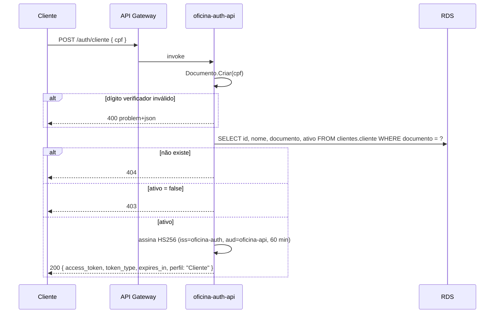

# Oficina Mecânica — Autenticação serverless (`oficina-lambda-auth`)

> **Tech Challenge — Fase 3 — Pós-Tech FIAP (15SOAT)**

Duas funções AWS Lambda em .NET 8:

| Função | O que faz | Onde roda |
|---|---|---|
| `oficina-auth-api` | **Emissor único de JWT.** `POST /auth/cliente` autentica o cliente pelo **CPF** (valida dígitos → existe? → ativo?). `POST /auth/admin` autentica Admin/Atendente por usuário e senha contra `auth.usuario`. | Dentro da VPC (subnet privada), acessa o RDS |
| `oficina-auth-authorizer` | **Lambda Authorizer** do API Gateway: valida assinatura HS256, `iss`, `aud` e expiração de todo token que chega a `/api/v1/*`. | Fora da VPC (não toca no banco) |

A API (`oficina-app`) **não emite** token — só valida. Quem emite é este repositório.

## Repositórios relacionados

| Repositório | Responsabilidade |
|---|---|
| [`oficina-app`](https://github.com/lcr-thiago-fernandes/oficina-app) | API .NET 8 em Kubernetes; documentação arquitetural central (`docs/`) |
| `oficina-infra-k8s` | VPC, EKS, ECR, NLB interno, **API Gateway**, VPC Link, New Relic |
| `oficina-infra-db` | RDS PostgreSQL 16 |
| `oficina-lambda-auth` (este) | Autenticação serverless e Lambda Authorizer |

Contratos: [`docs/contratos.md`](docs/contratos.md) (deste repo) e
[`oficina-app/docs/contratos-entre-repositorios.md`](https://github.com/lcr-thiago-fernandes/oficina-app/blob/develop/docs/contratos-entre-repositorios.md).

## Arquitetura

```mermaid
flowchart LR
    C[Cliente / Front] -->|POST /auth/cliente<br/>POST /auth/admin| GW[API Gateway<br/>HTTP API]
    C -->|GET /api/v1/me/*<br/>Authorization: Bearer| GW
    GW -->|/auth/*| API[Lambda oficina-auth-api<br/>.NET 8 · VPC]
    GW -->|authorizer| AUTH[Lambda oficina-auth-authorizer<br/>.NET 8 · fora da VPC]
    GW -->|/api/v1/{proxy+}<br/>VPC Link → NLB| EKS[EKS · oficina-app]
    API -->|SELECT cliente / usuario| RDS[(RDS PostgreSQL)]
    API -->|oficina/jwt_secret<br/>oficina/db_password| SM[Secrets Manager]
    API -->|falhas por IP/usuário| DDB[(DynamoDB<br/>oficina-auth-tentativas)]
    AUTH -->|oficina/jwt_secret| SM
    EKS -->|valida o mesmo JWT| SM
```

### Fluxo de `POST /auth/cliente`



## Contrato do token

```
iss = oficina-auth · aud = oficina-api · alg = HS256 · exp = agora + 60 min
claims: sub, perfil, documento (só Cliente), nome, jti
perfil ∈ { Cliente, Atendente, Admin }
```

Respostas de erro em `application/problem+json`. `401` traz `WWW-Authenticate: Bearer`;
`429` traz `Retry-After` (segundos).

| Rota | 200 | 400 | 401 | 403 | 404 | 429 |
|---|---|---|---|---|---|---|
| `POST /auth/cliente` | token | CPF inválido | — | cliente inativo | CPF sem cadastro | a partir da 10ª falha do mesmo IP em 15 min |
| `POST /auth/admin` | token | campos vazios | usuário inexistente **ou** senha errada | usuário inativo (só com senha certa) | — | a partir da 5ª falha no mesmo usuário ou da 10ª do mesmo IP em 15 min |

## Stack

| Camada | Tecnologia |
|---|---|
| Runtime | .NET 8 (`dotnet8` na Lambda), ReadyToRun |
| HTTP | ASP.NET Core Minimal API + `Amazon.Lambda.AspNetCoreServer.Hosting` |
| Token | `Microsoft.IdentityModel.JsonWebTokens` 8.2.1 (mesma versão que valida no `oficina-app`) |
| Banco | Npgsql 8 (SQL direto, sem ORM, sem migrations — este repo só lê) |
| Senhas | BCrypt.Net-Next (verificação do hash gravado pelo bootstrap da API) |
| Segredos | AWS Secrets Manager, cache estático por container |
| Força bruta | DynamoDB (`PAY_PER_REQUEST`, TTL) |
| IaC | Terraform ≥ 1.5, provider AWS ~> 5.60, backend S3 + DynamoDB |
| Testes | xUnit, FluentAssertions, Moq, Testcontainers (PostgreSQL 16), `WebApplicationFactory` |
| CI/CD | GitHub Actions com OIDC (sem chave estática), CodeQL, Dependabot |

## Estrutura

```
src/OficinaAuth.Dominio          Documento (cópia do oficina-app), Username, VerificadorDeSenha, Perfis
src/OficinaAuth.Aplicacao        casos de uso, EmissorDeToken, ProtecaoContraForcaBruta, portas
src/OficinaAuth.Infraestrutura   Npgsql, Secrets Manager, DynamoDB
src/OficinaAuth.Api              Lambda oficina-auth-api (Minimal API)
src/OficinaAuth.Authorizer       Lambda oficina-auth-authorizer
tests/                           um projeto de teste por projeto de código
terraform/                       Lambdas, IAM, SG, DynamoDB, rotas/authorizer no API Gateway, SSM
scripts/empacotar.sh             publish linux-x64 + zip
http/auth.http                   roteiro de requisições
```

## Como rodar localmente

Pré-requisitos: .NET 8 SDK, Docker, o `oficina-app` clonado ao lado.

1. Suba o banco pelo `oficina-app` (migra e cria o `admin`):
   ```bash
   cd ../oficina-app && cp .env.example .env && docker compose -f docker/docker-compose.yml up -d
   ```
2. Configure este repo:
   ```bash
   cp .env.example .env
   # JWT_SECRET precisa ser IGUAL ao do oficina-app/.env
   ```
3. Rode a função como API comum (fora da Lambda ela sobe em Kestrel):
   ```bash
   set -a && source .env && set +a
   dotnet run --project src/OficinaAuth.Api
   ```
4. Use `http/auth.http` com `@host = http://localhost:8081`. Cadastre um cliente pela
   API de gestão (`oficina-app`, porta 8080) com o token de admin obtido aqui.

Testes: `dotnet test` (os de Infraestrutura sobem um PostgreSQL via Testcontainers).

## Deploy

Ordem de provisionamento da Fase 3: `bootstrap → oficina-infra-k8s → oficina-infra-db →`
**`oficina-lambda-auth`** `→ oficina-app`. Este repositório lê do SSM o que os dois
anteriores publicaram (ver `docs/contratos.md`).

| Branch | Ação do CD |
|---|---|
| `develop` | `terraform plan` |
| `main` | `terraform apply` |

Segredos/variáveis do GitHub: `AWS_LAMBDA_ROLE_ARN` (secret; role `oficina-gha-lambda`
criada pelo `oficina-infra-k8s`) e `AWS_REGION` (variable).

Manual, da máquina:
```bash
./scripts/empacotar.sh
terraform -chdir=terraform init
terraform -chdir=terraform apply -var-file=exemplo.tfvars
```

Os valores lidos do SSM (`data.aws_ssm_parameter`) são marcados como sensíveis pelo
provider AWS, então boa parte do `terraform plan` deste repositório aparece como
`(sensitive value)`. É esperado, não é erro.

`terraform destroy` deste repo roda **antes** do `oficina-infra-db` e do `oficina-infra-k8s`.

## Observabilidade

New Relic por layer (`var.newrelic_layer_arn`); desligado por padrão até a conta existir.
Logs JSON no CloudWatch com `correlationId` (header `X-Correlation-Id`, mesmo da API).

## Decisões e limitações registradas

1. **Rota protegida `ANY /api/v1/{proxy+}` é criada aqui**, não no `infra-k8s`, para a
   ordem de `apply` ser linear (o authorizer só existe depois do API). Exige
   `/oficina/apigw/vpc_link_integration_id` no SSM.
2. **Força bruta em DynamoDB**, não no banco: evita migration no schema do `oficina-app`.
   Contagem por IP (10) e por usuário (5) em janela de 15 min. O TTL do DynamoDB é só
   faxina; a expiração é conferida em código.
3. **Segredo cacheado por container.** Rotacionar `oficina/jwt_secret` exige novo deploy
   das duas funções (ou esperar reciclagem) **e** rollout da API — os dois lados precisam
   trocar juntos.
4. **`/auth/cliente` aceita CNPJ**: o cadastro da API permite clientes PJ; o campo se
   chama `cpf` por fidelidade ao enunciado.
5. **401 uniforme e tempo constante** no login admin: usuário inexistente e senha errada
   respondem igual; o BCrypt roda contra um hash fictício quando não há usuário.
6. **Authorizer com resposta simples** (`isAuthorized` + contexto), não policy IAM.
7. **`Documento.cs` é cópia** (ADR-019): o job `paridade-documento` do CI compara com o
   original a cada PR.
8. **`/auth/cliente` autentica só com o CPF**, um identificador semipúblico. O limitador
   por IP contém enumeração, mas quem já conhece um CPF cadastrado obtém tokens à
   vontade. É o desenho do enunciado da fase, não um defeito — a mitigação natural
   seria um segundo fator, fora de escopo aqui.

## Swagger

Este repositório não expõe Swagger (duas rotas, documentadas acima e em
`http/auth.http`). O Swagger da API fica em `GET /swagger` do API Gateway
(rota pública criada pelo `oficina-infra-k8s`).

## Licença

Uso acadêmico — FIAP Pós-Tech 15SOAT.
